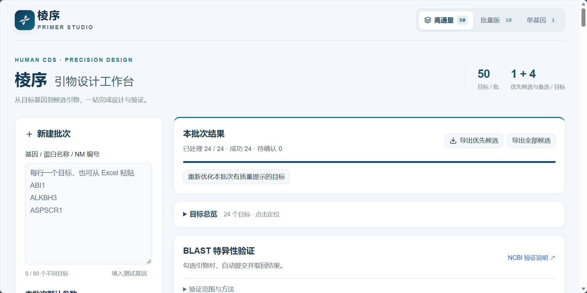
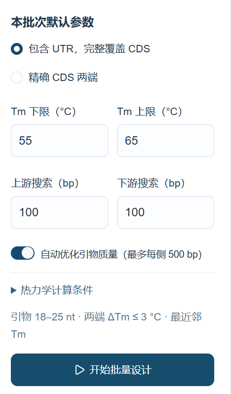
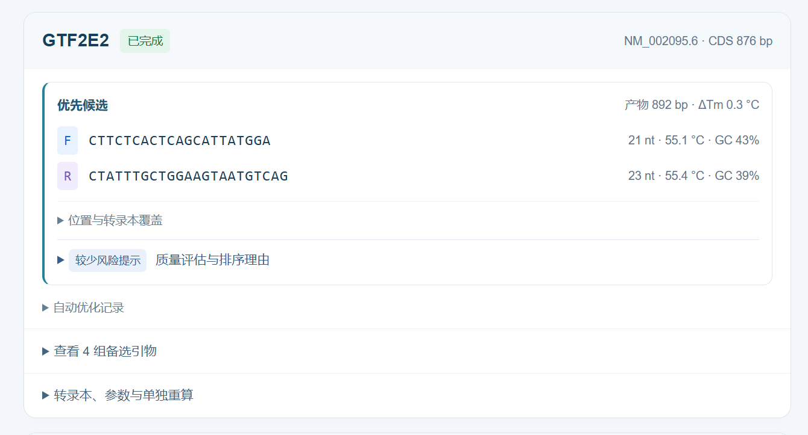
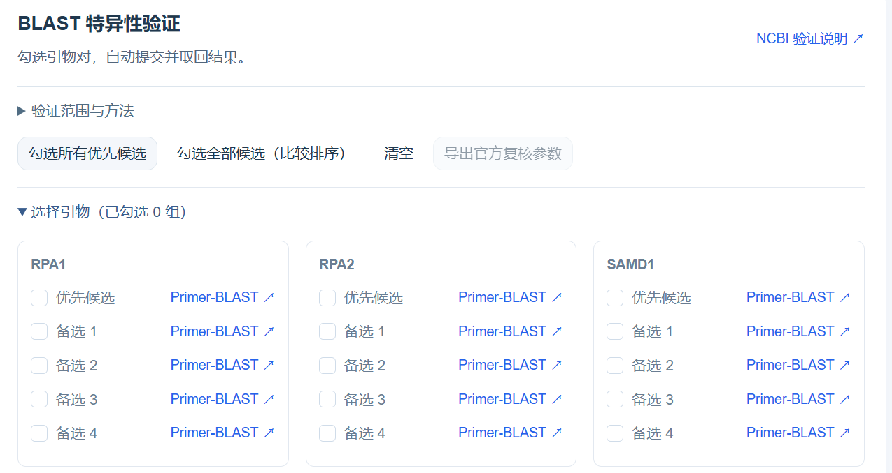
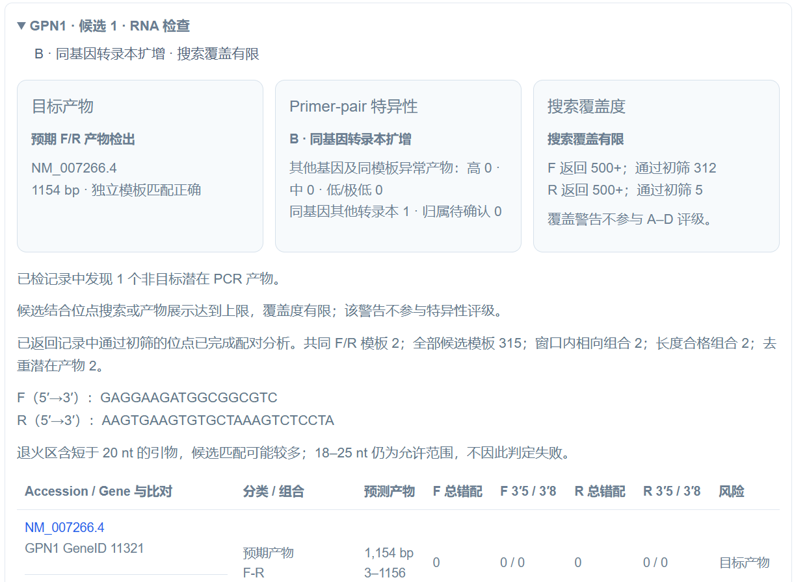
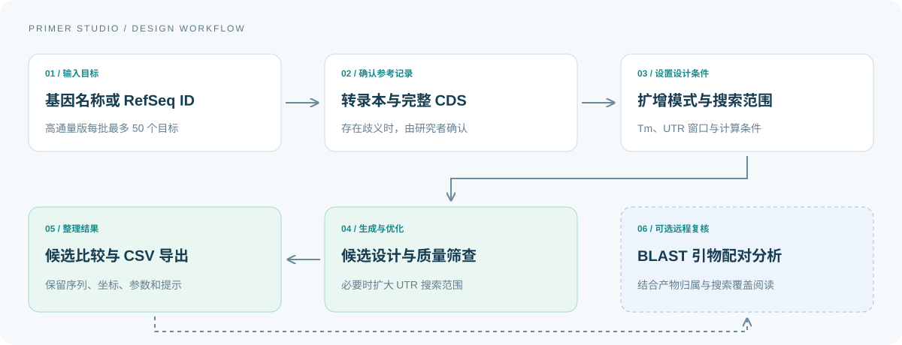

<p align="center"></p>

<div align="center">

## 棱序 Primer Studio · 人源完整 CDS 引物设计

**让引物设计有据可循，让实验准备井然有序。**

人源转录本检索 · 完整 CDS 引物设计 · 批量质量筛查 · 配对特异性分析

**[打开棱序·高通量 ↗](https://human-cds-primer-throughput-lab.lwhjq6666.chatgpt.site/)**

[项目介绍](#introduction)　/　[界面演示](#interface-gallery)　/　[设计流程](#workflow)　/　[快速开始](#quickstart)　/　[代码导览](#code-guide)　/　[验证说明](#verification)

<sub>TypeScript · React 19 · vinext · Cloudflare Workers · D1</sub>

</div>

---

<a id="introduction"></a>

## 01　项目介绍

### 从真实的实验准备出发

为多个基因准备完整 CDS 扩增引物时，工作往往分散在几个环节：在数据库中查找参考转录本、核对 CDS 注释、选择扩增边界、比较引物参数，再把序列与结果整理进表格。目标数量增加后，重复查询、复制与核对也随之增加；重新调整一个参数，还需要确认它影响了哪些候选和结果。

棱序从这类分子克隆准备需求出发，将**转录本、设计条件、候选引物和复核依据**放在同一条工作流程中。它希望解决的不只是“生成一对序列”，还包括几个实际问题：选的是哪条转录本？产物是否覆盖完整 CDS？为什么优先展示这一对引物？结果来自本地计算还是远程检索？当查询中断时，能否保留已经完成的目标？

在批量工作台中，研究者可以逐项确认存在歧义的转录本、调整搜索范围、查看候选与备选、继续未完成的任务，并将结果导出为 CSV。每条候选保留坐标、长度、Tm、GC 和质量提示，便于回到具体序列进行复核。对于 BLAST 返回的位点，程序进一步检查引物能否形成方向与距离合理的潜在扩增组合，而不是仅列出单条引物的命中记录。

**项目定位：面向人源完整 CDS 扩增的科研工具原型。** 项目由实验需求驱动，使用 AI 辅助开发；当前软件结果用于支持研究者判断，尚不能替代湿实验验证。FLAG 同源臂设计、细胞系表达量推荐与 LLM Agent 不属于当前实现。

### 选择适合的工作台

<table align="center" width="100%">
<thead><tr><th align="center" width="33%">棱序·单基因</th><th align="center" width="33%">棱序·小批量</th><th align="center" width="34%">棱序·高通量</th></tr></thead>
<tbody>
<tr><td align="center"><strong>1 个目标 / 次</strong></td><td align="center"><strong>最多 10 个目标 / 批</strong></td><td align="center"><strong>最多 50 个目标 / 批</strong></td></tr>
<tr><td align="center">逐条研究参考转录本<br/>比较扩增模式与参数</td><td align="center">准备一组候选基因<br/>逐项确认并整理结果</td><td align="center">组织较大规模引物准备<br/>分批浏览、恢复任务与统一导出</td></tr>
<tr><td align="center"><a href="https://human-cds-primer-throughput-lab.lwhjq6666.chatgpt.site/single"><strong>打开单基因版 ↗</strong></a></td><td align="center"><a href="https://human-cds-primer-batch-lab.lwhjq6666.chatgpt.site/"><strong>打开小批量版 ↗</strong></a></td><td align="center"><a href="https://human-cds-primer-throughput-lab.lwhjq6666.chatgpt.site/"><strong>打开高通量版 ↗</strong></a></td></tr>
<tr><td align="center"><sub>源码：app/single<br/>运行路径：/single</sub></td><td align="center"><sub>独立部署；本仓库提供在线入口<br/>尚未收录该部署的完整源码</sub></td><td align="center"><sub>本仓库的主应用，运行路径：/<br/>下方界面与批量功能说明以此版为例</sub></td></tr>
</tbody></table>

单基因版与高通量版由本仓库同一应用提供，小批量版独立部署。各部署分别保存任务历史；在线访问权限由对应站点配置决定。通量表示任务容量，不表示同时向 NCBI 发起同等数量的请求。

<p align="center"><sub><strong>高通量版设计规格</strong>　18–25 nt 引物长度　·　每目标最多 5 对候选　·　两种 CDS 扩增模式　·　CSV 结果导出</sub></p>

<a id="interface-gallery"></a>

## 02　界面演示

**以棱序·高通量（最多 50 个目标 / 批）为例。** 以下是实际运行页面：总览截图中的示例批次包含 24 个目标，其他图片分别展示参数、候选与复核结果。各图不构成同一条连续任务，点击可查看原图。

### 工作台总览

[](docs/assets/workbench-overview.png)

**左侧设置任务，右侧查看进度与结果。** 图中 24 / 24 个目标完成设计处理，可以导出优先候选或全部候选。“成功 24”表示工作台处理状态，不代表已经完成实验或特异性验证。

### 参数设置与搜索范围

<table align="center" width="100%">
<tr>
<td width="34%" align="center" valign="middle"><a href="docs/assets/design-settings.png"></a></td>
<td width="66%" valign="middle">
<h4>这组参数如何影响候选？</h4>
<p><strong>扩增模式｜包含 UTR</strong><br/>允许在 CDS 边界外寻找结合位点，同时保留完整 CDS。切换为精确 CDS 时，两端边界保持固定。</p>
<p><strong>温度条件｜55–65 °C</strong><br/>筛选符合区间的候选；两条引物的 ΔTm 还需满足 ≤3 °C。计算采用的离子与浓度条件可进一步展开查看。</p>
<p><strong>初始窗口｜上下游各 100 bp</strong><br/>定义最初允许搜索的范围；可用序列不足时，由实际转录本边界截限。</p>
<p><strong>自动优化｜最多每侧 500 bp</strong><br/>当候选触发质量提示时，尝试扩展搜索，并记录使用的范围与优化结果。长度、Tm 和 CDS 覆盖要求仍然保留。</p>
<p><sub>这些数值来自示例截图。实际设置应结合模板、扩增目的与实验条件确定。</sub></p>
</td></tr>
</table>

### 候选结果与备选

[](docs/assets/primer-candidate.png)

**GTF2E2 示例：**参考转录本 NM_002095.6，CDS 长 876 bp，候选产物长 892 bp，ΔTm 为 0.3 °C。卡片优先展示 F/R 序列及计算参数，将坐标、评估依据与 4 组备选收纳在展开项中。“较少风险提示”描述当前质量筛查结果，不等于特异性通过。

### 选择引物对进行复核

[](docs/assets/blast-selection.png)

**按优先候选或备选组织检查。** 此图尚未勾选引物对，展示的是提交前的选择界面。每组候选同时提供官方 Primer-BLAST 入口，便于核对参数后单独复核。

### 阅读配对特异性结果

[](docs/assets/specificity-report.png)

**GPN1 示例：**检出 NM_007266.4 的 1,154 bp 预期产物，同时发现 1 个同基因其他转录本潜在产物，评级为 **B · 同基因转录本扩增**。F/R 返回记录均为 500+，页面因此独立提示 **搜索覆盖有限**。两项信息需要结合阅读，不能将 B 级结果理解为检索已穷尽。详见 [A–D 评级标准](#specificity-grades)。

<p align="center"><sub>原始页面截图于 2026-09-15 收录；保留真实参数、结果与限制说明。</sub></p>

<a id="workflow"></a>

## 03　设计流程

<p align="center"></p>

<table align="center" width="100%">
<thead><tr><th align="center" width="20%">操作阶段</th><th align="center" width="40%">需要确认的内容</th><th align="center" width="40%">得到的结果</th></tr></thead>
<tbody>
<tr><td align="center"><strong>检索目标</strong></td><td>输入基因名称或 RefSeq ID；核对人源转录本与 CDS 注释。</td><td>供选择的参考转录本；有歧义的目标保留确认步骤。</td></tr>
<tr><td align="center"><strong>设置与设计</strong></td><td>选择扩增模式、Tm 区间、搜索窗口及计算条件。</td><td>候选序列、结合坐标、产物长度及本地质量提示。</td></tr>
<tr><td align="center"><strong>检查与整理</strong></td><td>比较优先与备选；按需要提交配对分析，阅读覆盖限制。</td><td>CSV 导出；可选的远程检索与潜在扩增产物分析。</td></tr>
</tbody></table>

### 功能与实现

<table align="center" width="100%">
<thead><tr><th align="center" width="19%">功能模块</th><th align="center" width="59%">处理方式</th><th align="center" width="22%">源码</th></tr></thead>
<tbody>
<tr><td align="center"><strong>转录本检索</strong></td><td>读取人源 RefSeq 记录，结合缓存、节流和重试处理公共接口的响应。</td><td align="center"><a href="lib/ncbi/service.ts">查询服务</a></td></tr>
<tr><td align="center"><strong>任务管理</strong></td><td>保存目标与任务状态，支持暂停、继续和失败重试；转录本有歧义时等待确认。</td><td align="center"><a href="lib/batch/core.ts">任务处理</a> · <a href="lib/batch/store.ts">数据存储</a></td></tr>
<tr><td align="center"><strong>候选设计</strong></td><td>支持精确 CDS 和含 UTR 模式，计算结合位置并检查产物覆盖。</td><td align="center"><a href="lib/primer.ts">设计算法</a></td></tr>
<tr><td align="center"><strong>质量与优化</strong></td><td>批量设计使用近邻模型 Tm，筛查 GC、重复与连续互补；必要时扩大 UTR 搜索范围。</td><td align="center"><a href="lib/quality/thermo.ts">质量计算</a> · <a href="lib/batch/adaptive.ts">扩展搜索</a></td></tr>
<tr><td align="center"><strong>配对特异性</strong></td><td>组合 BLAST 返回的 F–R、F–F、R–R 位点，检查方向、距离、错配与产物归属。</td><td align="center"><a href="lib/blast/pair-engine.ts">配对分析</a></td></tr>
<tr><td align="center"><strong>结果导出</strong></td><td>以 CSV 保存候选、坐标、计算条件、质量提示与实际搜索范围，便于后续核对。</td><td align="center"><a href="lib/batch/view.ts">展示与导出</a></td></tr>
</tbody></table>

<a id="quickstart"></a>

## 04　快速开始

### 在线使用

打开上方对应工作台，输入目标并检查默认参数。第一次使用可先用一个已知基因熟悉转录本选择、候选结果与导出流程，再逐步增加任务数量。

### 本地运行

需要 **Node.js 24 和 npm**。本仓库采用 vinext 与 Cloudflare Workers 运行架构，通过本地 D1 模拟环境保存任务与缓存。

```bash
git clone https://github.com/xiaohan-66/Human-cds-primer-lab-hjq.git
cd Human-cds-primer-lab-hjq
npm ci
npx wrangler d1 migrations apply DB --local --config wrangler.local.json
npm run dev
```

打开终端显示的本地地址。根路径 `/` 为棱序·高通量，`/single` 为棱序·单基因。上述命令不启动独立的小批量部署。

<details>
<summary><strong>运行配置与数据说明</strong></summary>

- 本地迁移用于创建任务与缓存所需的数据表，启动前需执行一次；以后有新迁移时再次执行。
- 无 NCBI Key 时可尝试查询，但受公共接口限制。可选服务端变量名见 [.env.example](.env.example)，应通过当前运行环境的服务端配置传入。
- `.openai/hosting.json` 只保留本地 DB 绑定名称，不包含原网站项目标识。仓库不附带运行数据库、用户批次或部署凭据。
- 本地应用使用自己的数据状态，不会自动加载线上任务历史。
- 现有验证使用已安装依赖；全新环境的 `npm ci` 安装尚未独立验证。

</details>

<a id="code-guide"></a>

## 05　代码导览

### 从一次请求理解项目

以新建批次为例，页面在 [app/page.tsx](app/page.tsx) 收集目标与参数，请求交给 [批次 API](app/api/batches/route.ts)。服务端通过 `lib/batch` 解析输入与维护状态，调用 `lib/ncbi` 获取参考记录，再进入 `lib/primer.ts` 与质量计算模块。结果由存储层保存，前端读取后渲染候选卡片并提供 CSV 导出。

可选 BLAST 流程由 [BLAST API](app/api/blast/route.ts) 处理。远程任务与结果回读在 `lib/blast/service.ts` 中组织，位点配对、产物分类和排序分别由该目录内的模块完成。

```text
app/
├── page.tsx                 高通量工作台与批次交互
├── single/page.tsx          单基因设计页面
└── api/                     ncbi、batches、blast 请求入口
components/
├── studio-header.tsx        三种通量导航与页头
├── quality-details.tsx      质量参数与提示
├── blast-panel.tsx          候选勾选、任务提交与回读
└── specificity-result.tsx   配对产物、评级与覆盖度展示
lib/
├── primer.ts                候选枚举、扩增边界与设计结果
├── batch/                   输入、状态、存储、自动优化与导出
├── ncbi/                    查询服务、缓存与请求节流
├── quality/                 近邻模型 Tm 与结构启发式筛查
└── blast/                   远程任务、位点配对、分类与排序
db/ + drizzle/               数据表定义与 SQL 迁移
tests/                       回归测试、公开参考记录与合成用例
```

**建议阅读顺序：**先看 `lib/primer.ts` 理解单次设计，再看 `lib/batch/core.ts` 与 `adaptive.ts` 理解批量处理和自动优化，最后阅读 `lib/blast/pair-engine.ts` 与 [配对方法说明](BLAST-SPECIFICITY.md)。修改参数上限前，先检查 [limits.ts](lib/batch/limits.ts) 和相应测试。

<a id="verification"></a>

## 06　验证说明

### 已有验证覆盖什么

<table align="center" width="100%">
<thead><tr><th align="center" width="21%">检查方向</th><th align="center" width="53%">主要覆盖</th><th align="center" width="26%">测试文件</th></tr></thead>
<tbody>
<tr><td align="center">序列与扩增边界</td><td>反向互补、完整 CDS 覆盖、含 UTR 搜索、终止密码子处理及无效输入。</td><td><a href="tests/primer.test.mjs">primer</a> · <a href="tests/flanking.test.mjs">flanking</a></td></tr>
<tr><td align="center">质量计算与优化</td><td>独立 Tm 参考值、结构筛查、扩展搜索、严格长度与 Tm 约束、失败回退。</td><td><a href="tests/thermo.test.mjs">thermo</a> · <a href="tests/adaptive.test.mjs">adaptive</a></td></tr>
<tr><td align="center">批次与缓存</td><td>目标上限、去重、状态合并、恢复、CSV 完整性、缓存与请求节流。</td><td><a href="tests/batch.test.mjs">batch</a> · <a href="tests/throughput.test.mjs">throughput</a> · <a href="tests/ncbi.test.mjs">ncbi</a></td></tr>
<tr><td align="center">配对与归属</td><td>方向和距离、同引物配对、错配、目标缺失、GeneID 分类、返回上限与不完整分析。</td><td><a href="tests/blast.test.mjs">blast</a> · <a href="tests/pair-engine.test.mjs">pair-engine</a> · <a href="tests/classification.test.mjs">classification</a> · <a href="tests/verification-upgrade.test.mjs">verification-upgrade</a></td></tr>
</tbody></table>

2026-09-15 的已有记录包括 **11 个离线测试文件、TypeScript 检查和完整构建通过**。随后同步棱序界面时，复跑了类型检查、批量容量与自动优化测试，并完成构建。本次 README 排版调整仅检查文档、链接与图像资源，不增加新的算法验证结论。详细范围见 [VALIDATION.md](VALIDATION.md)。

### 如何复跑

在项目根目录运行一个测试，例如自动优化回归：

```bash
node --import ./tests/register.mjs --experimental-transform-types tests/adaptive.test.mjs
```

其余 `tests/*.test.mjs` 采用相同入口，替换末尾文件名即可。`register.mjs` 为测试中的 TypeScript 相对导入提供解析支持。

```bash
# 检查类型
npx tsc --noEmit --incremental false

# 构建客户端与服务端产物
npm run build
```

`batch-http.mjs`、`quality-bulk-http.mjs` 等脚本需要相应本地服务；`blast-live.mjs` 会请求外部服务。它们不属于上述离线测试集合。50 目标回归验证的是任务和数据流，并非 50 个基因的湿实验。

<a id="specificity-grades"></a>

### 引物特异性评级说明

完成引物配对分析后，工具依据**本次返回并已分析的潜在 PCR 产物**给出 A–D 级结果。分析包括 F–R、F–F 与 R–R 组合；评级与“搜索覆盖度”分别展示，需结合阅读。

<table align="center" width="100%">
<thead><tr><th align="center" width="9%">等级</th><th align="center" width="21%">含义</th><th align="center" width="43%">判定与结果解释</th><th align="center" width="27%">使用建议</th></tr></thead>
<tbody>
<tr><td align="center">🟢 <strong>A</strong></td><td align="center"><strong>已分析记录中<br/>未发现非目标产物</strong></td><td>满足评级前提，且未触发 B、C 或 D 条件。表示本次分析未发现非目标潜在产物，不表示已排除所有脱靶。</td><td>可优先纳入候选；结合覆盖度、质量提示与实验条件继续复核。</td></tr>
<tr><td align="center">🟡 <strong>B</strong></td><td align="center"><strong>同基因转录本扩增</strong></td><td>发现同一基因其他转录本的潜在产物，且未触发 C 或 D 条件；归属依据 Gene ID 等注释判断。</td><td>按实验目的判断；若需区分特定异构体，应重新检查结合位置或设计候选。</td></tr>
<tr><td align="center">🟠 <strong>C</strong></td><td align="center"><strong>潜在非目标产物<br/>或归属待确认</strong></td><td>存在未达到高风险阈值的其他基因、同转录本异常或基因组潜在产物，或有非目标产物缺少可靠基因归属。无 D 级高风险产物。</td><td>人工核查产物归属、错配位置和实验相关性；必要时选择备选或重新设计。</td></tr>
<tr><td align="center">🔴 <strong>D</strong></td><td align="center"><strong>高风险非目标扩增</strong></td><td>其他基因、同转录本异常或基因组潜在产物触发当前规则的高风险判定（风险分数 ≥80）。</td><td>不宜直接作为最终实验引物；优先检查其他候选并复核，必要时重新设计。</td></tr>
</tbody></table>

**评级前提与优先顺序：**RNA 检查需在返回记录中检出预期配对产物，且本地目标模板校验未显示不匹配；基因组检查需本地目标模板校验匹配。配对计算未触发安全上限时，按 **D → C → B → A** 的顺序确定等级。

**“暂不评级”不等于 D 级。** 目标校验不满足上述前提，或配对计算、产物保存触及安全上限而未完成分析时，工具暂不评级。远程未检出预期配对，也不能直接推断引物无法扩增。

**“搜索覆盖有限”独立于 A–D。** 返回记录达到上限时，已有产物仍可获得等级，但结论仅覆盖已分析记录，不因此自动降为 D。人源搜索范围无法核验时，同样应结合范围提示谨慎解释。

> **评级反映计算预测，不是 PCR 实验成功率。** A 级不保证扩增成功；Tm、GC、二聚体、发卡结构、模板质量及 PCR 条件仍会影响实验。风险分数是未经湿实验校准的规则指标，不是扩增概率。

判定实现见 [pair-classification.ts](lib/blast/pair-classification.ts)，评分方法见 [配对特异性说明](BLAST-SPECIFICITY.md)。

### 结果应如何使用

候选由本项目算法生成，并非 Primer3 输出。批量 Tm 使用近邻模型；结构评估是连续 Watson–Crick 互补筛查，未实现完整折叠自由能计算。BLAST 分析限于返回记录，风险分数未经实验校准，不等于扩增概率。历史结果与新版计算存在方法差异时，应重新设计或复核。

[质量计算方法](docs/quality-method.md)　·　[配对特异性方法](BLAST-SPECIFICITY.md)　·　[批量处理说明](THROUGHPUT.md)

<details>
<summary><strong>版本记录｜2026.09.15</strong></summary>

- 棱序品牌与导航统一为单基因、小批量和高通量三个入口；本文采用“棱序·单基因 / 棱序·小批量 / 棱序·高通量”命名，截图保留网站原始标签。
- 高通量版更新标题区、容量摘要、候选展示与底部分页，单基因页面同步整体样式。
- 当前仓库应用源码同步自高通量版 `72b8abc`；小批量版导航依据独立部署的 `617e2b1` 核对。
- 在线部署与仓库提交可能处于不同版本。源代码、验证记录与页面结果应结合查看。

</details>


